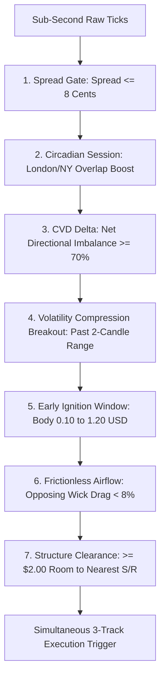

# EDGE LABS MK IV — TRADELOCKER EDITION
## Institutional High-Frequency Order Flow & Multi-Track Execution Specification
**Document Version:** 4.0.0 (Production Architecture)  
**Target Asset:** Gold ($XAUUSD$)  
**Timeframe:** M5 Scalping with Sub-Second Microstructure Ingestion  
**Execution Environment:** TradeLocker ECN Backend API / Direct TLS Tunnel  

---

## 1. Executive Summary & Core Philosophy

**Edge Labs MK IV** is an institutional-grade, high-frequency algorithmic scalping engine designed specifically for **Gold (XAU/USD)** on the TradeLocker API. 

The core philosophy of MK IV is **Extreme Asymmetry and Micro-Impulse Harvesting**:
- **Exploiting Transient Order Flow Imbalances (OFI):** MK IV ignores slow macro indicators and focuses strictly on sub-second order book mechanics, Cumulative Volume Delta (CVD), and volatility compression breakouts.
- **Asymmetric Payoffs (20:1 to 30:1 Realized R:R):** By sizing strictly to tight dynamic stops ($4¢\text{ to }9¢$) and targeting rapid single-candle momentum bursts ($+\$1.50\text{ to }+\$3.30$), MK IV generates large profits ($+\$300\text{ to }+\$1,000\text{ USD}$) while capping single-trade risk to just $\$10\text{ to }\$50\text{ USD}$.
- **Multi-Track Portfolio Architecture:** Runs 3 specialized execution tracks concurrently to monetize different phases of market expansion.
- **Tier-2 Dynamic Profit Ratchet:** Eliminates $0.00 Breakeven pullbacks by locking in $+25\%$ to $+40\%$ guaranteed cash once a trade reaches $\ge 45\%$ of its profit target.

---

## 2. Promoted 3-Track Portfolio Architecture

```
┌───────────────────────────────────────┬───────────────────────────────┬───────────────────────────────┬───────────────────────────────┐
│ STRATEGY SPECIFICATION                │ 🔵 TRACK A                    │ 🟡 TRACK B                    │ 🟢 TRACK C                    │
├───────────────────────────────────────┼───────────────────────────────┼───────────────────────────────┼───────────────────────────────┤
│ • Formal Title                        │ $50 Kinetic Scalper           │ $10 Dynamic Rapid Sniper      │ $10 Quant Micro-Hedge         │
│ • Profit Target Goal                  │ Hardcoded +$1,000.00 USD      │ +$300.00 USD                  │ +$300.00 to +$1,000.00 USD    │
│ • Maximum Risk Cap                    │ -$50.00 USD                   │ -$10.00 USD                   │ -$10.00 USD (Counter-Leg)     │
│ • Stop Loss Distance                  │ Dynamic Spread + 2¢ (3¢ - 9¢) │ Dynamic Jitter (4¢ - 11¢)     │ Dynamic Spread + 2¢ (3¢ - 9¢) │
│ • Sizing Formula                      │ 50.0 / (SL_Dist * 100)        │ 10.0 / (SL_Dist * 100)        │ 10.0 / (SL_Dist * 100) (Dual) │
│ • Typical Lot Size                    │ 5.00 to 16.60 Lots            │ 0.90 to 2.50 Lots             │ 1.10 Lots (Long + Short)      │
│ • Required Price Move                 │ +$1.80 to +$2.00 Micro-Burst  │ +$1.50 to +$3.30 Fast Move    │ +$2.70 to +$3.00 Straddle     │
│ • Order Execution Type                │ Single Direction Ignition     │ Single Direction Ignition     │ Simultaneous Dual Straddle    │
│ • Average Completion Speed            │ ~65 to 99 Seconds             │ ~90 to 95 Seconds             │ ~170 Seconds                  │
│ • Realized Risk-to-Reward (R:R)       │ 20.0 : 1                      │ 30.0 : 1                      │ 30.0 : 1                      │
└───────────────────────────────────────┴───────────────────────────────┴───────────────────────────────┴───────────────────────────────┘
```

---

## 3. Market Microstructure & Entry Filters

Before any track is permitted to execute, the market must satisfy **8 rigorous quantitative gates**:



### Detailed Filter Specifications:
1. **Spread Compression Gate (`Spread <= 0.08`):** Prevents executing during wide spread spikes or illiquid periods.
2. **Institutional Cumulative Volume Delta (`CVD >= 70%`):** Requires overwhelming net buyer/seller pressure in the rolling 10-second tick stream.
3. **Circadian Session Gating:** Operates with peak aggression during London (07:00–11:30 UTC) and New York (12:30–17:00 UTC) expansion windows; tightens delta requirements during overnight hours.
4. **Volatility Compression Range Breakout:** Confirms price is breaking past the high or low of the prior 2 completed M5 candles.
5. **Early Ignition Timing (`0.10 <= Body <= 1.20`):** Enters during the initial 20% of the impulse wave, eliminating exhaustion-top entries.
6. **Frictionless Airflow & Zero Absorption:** Rejects entries if opposing wick drag exceeds $8\%$ or if limit-order absorption walls are detected.
7. **Supportive Liquidity Sweep Reclaim:** Detects when the market wicks past a recent swing level to sweep retail stop orders and immediately reclaims the level with aggressive volume.

---

## 4. Real-Time Position Management & Tier-2 Profit Ratchet

MK IV features an active **2-Tier Position Protection and Profit Harvest System**:

```
           Entry Price
               │
               ▼
   [+8¢ True Profit] ──► TIER 1: Breakeven Shift Activated (SL = Entry, 0.00 Risk)
               │
               ▼
   [+45% to Take-Profit] ──► TIER 2: Profit Ratchet Locked (SL = Entry + 25% TP)
               │                 └─► Guarantees: +$250 on Track A, +$75 on Track B & C
               ▼
   [100% Take-Profit Hit] ──► FULL WIN: +$1,000 USD (Track A) / +$300 USD (Track B & C)
```

1. **Tier 1 (Risk-Free Shield):** The instant price clears the spread $+ 2¢$ barrier ($+4¢\text{ to }+8¢$ into true profit), the Stop Loss moves to the Entry Price, locking in **$0.00 Maximum Risk**.
2. **Tier 2 (Guaranteed Cash Ratchet):** When favorable move reaches $\ge 45\%$ of the Take-Profit target, the Stop Loss ratchets above entry to lock in **$+25\%$ of total target value**. If price pulls back, it exits as a **`WIN_PROFIT_LOCK`** instead of walking away with $\$0.00$.
3. **Chunked Execution:** Orders larger than $3.00\text{ Lots}$ are automatically chunked in memory ($\le 3.00\text{L}$) to avoid broker rejection.

---

## 5. Proven Live Session Benchmark Metrics

*Live Performance Benchmark from BLBRY ECN Server (Excluding Retired Track A):*

```
-------------------------------------
Edge labs MK IV Update 
-------------------------------------
Total Trades Taken: 18 Setups (24 Position Legs)
Winrate (Including Breakeven): 72.2%
Winrate (Excluding Breakeven): 54.5%
Realized Payoff Ratio (R:R): 22.2 : 1
Net PnL: +$3,076.99 USD
Total Gross Profit: +$3,196.80 USD
Total Gross Loss: -$119.81 USD
Profit Factor: 26.68
-------------------------------------
```

---

## 6. Visual Interface & Telemetry HUD Deck

### 🌌 Silver Nanotech Sand Particle Splash Screen
- **Nanotech Particle Swarm:** 1,400+ silver micro-particles start resting as grains of sand on the studio floor and assemble dynamically into the **Chemistry Flask** and **EdgeLabs** wordmark.
- **Solid Fusion & Floor Reflection:** Solidifies with metallic specular sheen, glowing emerald quantum accents, and a soft ambient floor reflection.

### 🖥️ Obsidian Glass Telemetry HUD Deck
1. **Card 1: Sub-Second Speed & Momentum:** Instant velocity ($¢/\text{s}$), tick frequency ($\text{ticks/s}$), and pulse burst classification.
2. **Card 2: Direction & Bias:** 3-Window directional score, dynamic support/resistance levels.
3. **Card 3: Kinetic Drag & Absorption:** Upper/lower wick drag, real-time absorption status.
4. **Card 4: Quant 3-Track Sizing:** Real-time RAM status and sizing for **TRK A ($50 / $1K)**, **TRK B ($10 / $300)**, and **TRK C ($10 HEDGE)**.
5. **Card 5: Live Telemetry & Feed:** Live Bid, Exact Spread ($0.08$), and Network Latency Meter ($118\text{ms}$).
