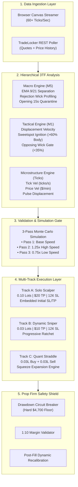

# EDGE LABS MK V: XAUUSD HIGH-FREQUENCY TRADING SYSTEM SPECIFICATION

```
========================================================================================
SYSTEM SPECIFICATION: EDGE LABS MK V
TARGET ASSET:         XAUUSD / GOLD (Spot CFD)
EXECUTION PLATFORM:   TradeLocker REST API + High-Speed Browser Telemetry
BROKER COMPLIANCE:    Blueberry Markets / HeroFX Prop Firm Protocols (1:10 Leverage)
ARCHITECTURE:         3-Timeframe Hierarchical Engine + 3-Track Multi-Leg Execution
========================================================================================
```

---

## 1. System Overview & Core Architecture

The **Edge Labs Mk V** is a sub-second, multi-timeframe algorithmic execution engine engineered specifically for Gold (`XAUUSD`). It combines macro trend anchoring on the 5-Minute timeframe, tactical impulse filtering on the 1-Minute timeframe, and millisecond-level tick velocity and pulse displacement analysis.



---

## 2. Macro Timeframe Analysis (M5 Candle Engine)

The M5 engine maintains a rolling buffer of 500 completed candles plus the live forming candle to establish structural market bias.

### 2.1 Exponential Moving Averages (EMA 9 & EMA 21)
* **Calculation:**
  $$\text{EMA}_{\text{today}} = \left( \text{Price}_{\text{close}} \times \alpha \right) + \left( \text{EMA}_{\text{yesterday}} \times (1 - \alpha) \right) \quad \text{where } \alpha = \frac{2}{N + 1}$$
  * $\text{EMA}_9$: Fast momentum curve ($\alpha = 0.20$).
  * $\text{EMA}_{21}$: Baseline trend curve ($\alpha = 0.0909$).
* **Trend Bias Determination:**
  * **Bullish Bias (`green`):** $\text{EMA}_9 > \text{EMA}_{21}$ and $\text{Price} > \text{EMA}_9$.
  * **Bearish Bias (`red`):** $\text{EMA}_9 < \text{EMA}_{21}$ and $\text{Price} < \text{EMA}_9$.
  * **Neutral / Chop (`mixed`):** $\text{EMA}_9$ within 4¢ of $\text{EMA}_{21}$ or price oscillating between EMAs.
* **EMA Separation Spread:** Distance in cents:
  $$\Delta_{\text{EMA}} = |\text{EMA}_9 - \text{EMA}_{21}| \times 100 \quad (\text{cents})$$

### 2.2 Rejection Wick Profiling & Ratios
To avoid buying into tops or selling into bottoms, the M5 engine calculates directional exhaustion:
* **Upper Wick Ratio:**
  $$\text{Ratio}_{\text{upper}} = \frac{\text{High} - \max(\text{Open}, \text{Close})}{\text{High} - \text{Low}}$$
  * $\text{Ratio}_{\text{upper}} > 0.35$: Moderate upside rejection (Long entries restricted or lot size reduced).
  * $\text{Ratio}_{\text{upper}} \ge 1.00$: Strong upper wick rejection (BUY orders blocked).
* **Lower Wick Ratio:**
  $$\text{Ratio}_{\text{lower}} = \frac{\min(\text{Open}, \text{Close}) - \text{Low}}{\text{High} - \text{Low}}$$
  * $\text{Ratio}_{\text{lower}} > 0.35$: Moderate downside rejection (Short entries restricted).
  * $\text{Ratio}_{\text{lower}} \ge 1.00$: Strong lower wick rejection (SELL orders blocked).

### 2.3 Candle Expansion Multiplier
* Calculates rolling 20-bar average body size: $\overline{\text{Body}}_{20}$.
* If $\text{Body}_{\text{current}} \ge 1.5 \times \overline{\text{Body}}_{20}$, the setup receives a **Large Body Expansion Bonus (+0.50 score)**.

### 2.4 Opening Window Quarantine
* **Rule:** Trading is disabled during the first **15 seconds** of every new 5-minute candle (`:00:00 - :00:15`, `:05:00 - :05:15`, etc.) to eliminate opening spread widening and false breakout whipsaws.

---

## 3. Tactical Timeframe Analysis (M1 Structure Engine)

The M1 engine tracks real-time bar development within the active 60-second cycle.

### 3.1 M1 Displacement
* Tracks real-time price deviation from the 1-minute open:
  $$\text{Displacement}_{\text{M1}} = \text{Current Price} - \text{Open}_{\text{M1}}$$

### 3.2 Sweetspot Ignition Gate
* Identifies explosive, clean institutional momentum:
  $$\text{Body Ratio}_{\text{M1}} = \frac{|\text{Close}_{\text{M1}} - \text{Open}_{\text{M1}}|}{\text{High}_{\text{M1}} - \text{Low}_{\text{M1}}}$$
* **Threshold:** $\text{Body Ratio}_{\text{M1}} \ge 0.60$ (Candle body must occupy at least 60% of total bar range).
* Direction must match the M5 Macro EMA bias.

### 3.3 Opposing Wick Gatekeeper
* Prevents entries where price has already begun pulling back against the impulse:
  * **For BUY:** $\text{Upper Wick Ratio}_{\text{M1}} = \frac{\text{High} - \text{Close}}{\text{High} - \text{Low}} \le \mathbf{0.35}$ (Upper wick must be $\le 35\%$).
  * **For SELL:** $\text{Lower Wick Ratio}_{\text{M1}} = \frac{\text{Close} - \text{Low}}{\text{High} - \text{Low}} \le \mathbf{0.35}$ (Lower wick must be $\le 35\%$).

---

## 4. Microstructure Speed & Velocity Engine (Sub-Second Ticks)

Calculates live order flow speed across a rolling 60-second tick buffer:

### 4.1 Speed Formulas
1. **Tick Velocity:**
   $$V_{\text{tick}} = \frac{\text{Total Ticks in last 60s}}{60.0} \quad (\text{ticks/second})$$
2. **Price Velocity:**
   $$V_{\text{price}} = \frac{|\text{Price}_{t} - \text{Price}_{t-60s}|}{60.0} \times 60.0 \quad (\$/\text{minute})$$
3. **Pulse Displacement Distance:**
   $$D_{\text{pulse}} = \frac{V_{\text{price}} / 60.0}{\max(1.0, V_{\text{tick}})}$$

### 4.2 Speed Tier Classification

| Metric | FAST Tier | MEDIUM Tier | SLOW Tier |
| :--- | :--- | :--- | :--- |
| **M5 Candle Body** | $\ge \$2.00$ | $\ge \$1.00$ | $< \$0.50$ |
| **Tick Velocity** | $\ge 100\text{ ticks/min}$ ($1.67\text{ t/s}$) | $\ge 50\text{ ticks/min}$ ($0.83\text{ t/s}$) | $< 20\text{ ticks/min}$ ($0.33\text{ t/s}$) |
| **Price Velocity** | $\ge \$0.50/\text{min}$ | $\ge \$0.20/\text{min}$ | $< \$0.10/\text{min}$ |

---

## 5. Three-Pass Monte Carlo Forward Simulation

Before any live order is routed, the engine validates the setup across 3 speed variants:

1. **Pass 1 (Base Market Speed):** Simulates forward path using current $V_{\text{price}}$ and $V_{\text{tick}}$ to determine if TP is hit before SL.
2. **Pass 2 (High-Speed Variant - 1.25x):** Simulates an aggressive 25% surge in counter-volatility.
3. **Pass 3 (Low-Speed Variant - 0.75x):** Simulates momentum stalling and spread friction.
4. **Pass Condition:** The trade setup **must pass all 3 passes** to trigger execution.

---

## 6. Multi-Track Execution Architecture

The bot splits capital across 3 specialized execution tracks:

```
========================================================================================
TRACK COMPARISON MATRIX
========================================================================================
TRACK   NAME           LOTS    TP TARGET         STOP LOSS        RR RATIO   ROLE
----------------------------------------------------------------------------------------
A       Solo Scalper   0.10L   $20.00 (+$2.00)   $0.12 (12¢)      16.7 : 1   Primary Engine
B       Dynamic Sniper 0.03L   $10.00 (+$3.33)   $0.12 (12¢)      27.8 : 1   Secondary Runner
C       Quant Straddle 0.06L*  $10.00 (+$3.33)   $0.12 (12¢)      27.8 : 1   Squeeze Hedge
========================================================================================
*Track C opens dual simultaneous 0.03L Buy + 0.03L Sell.
```

---

### 6.1 Track A: Solo Scalper (Primary Engine)

* **Allocation:** **0.10 Lots** (\$10.00 notional per \$1.00 Gold movement).
* **Profit Target:** **\$20.00 Gross** (+\$2.00 price move).
* **Stop Loss:** **12¢ (\$0.12)** from fill price.
* **Order Placement Protocol (Mk V):**
  * Submits `create_order` with `stop_loss = sl_price` and `take_profit = tp_price` embedded directly in the initial HTTP request.
  * Immediately after fill, queries TradeLocker `/positions` for exact fill price and issues `modify_position_with_retry` to snap SL/TP to exact fill levels.
* **Breakeven Protection Trigger:**
  * Once price moves **+10¢** in profit (or 85% of stop distance), Stop Loss shifts to **Entry Price** (`BE_PROTECTED`).
* **Tier-2 Profit Ratchet:**
  * Once price reaches **+90¢** in profit (45% of TP), Stop Loss shifts to `Entry + $0.50`, locking in **+$5.00 profit** (`RATCHET_WIN`).
* **Candle Churn Lockout:**
  * If a Track A position is stopped out at a loss, the active M5 candle is locked to prevent repeated re-entry churn on the same bar.

---

### 6.2 Track B: Dynamic Sniper

* **Allocation:** **0.03 Lots** (\$3.00 notional per \$1.00 Gold movement).
* **Profit Target:** **\$10.00 Gross** (+\$3.33 price move).
* **Stop Loss:** **12¢ (\$0.12)** from fill price.
* **Progressive Ratchet:**
  * Shifts Stop Loss into profit in **25% increments** of the total \$3.33 distance as price expands.

---

### 6.3 Track C: Quant Hedging Straddle

* **Allocation:** Simultaneous **0.03L BUY** and **0.03L SELL** orders.
* **Target:** +$3.33 expansion on winning leg (+$10.00 gross).
* **Stop Loss:** 12¢ on losing leg.
* **Economic Payout Profile:**
  $$\text{Losing Leg Loss} = -(0.12 \times 0.03 \times 100) - \$0.21\text{ fee} = \mathbf{-\$0.57}$$
  $$\text{Winning Leg Gain} = +(3.33 \times 0.03 \times 100) - \$0.21\text{ fee} = \mathbf{+\$9.78}$$
  $$\text{Net Straddle Profit} = +\$9.78 - \$0.57 = \mathbf{+\$9.21\text{ Net}}$$

---

## 7. Configuration Parameter Reference (`config.py`)

| Parameter Name | Default Value | Unit / Type | Description |
| :--- | :--- | :--- | :--- |
| `BASE_PROFIT_TARGET` | `1000` | USD (float) | Baseline system profit reference. |
| `MAX_LOSS_ALLOWED` | `10` | USD (float) | Hard cap maximum loss allowed per trade. |
| `MAX_DAILY_EXECUTIONS`| `2` | int | Daily session execution limit parameter. |
| `SYMBOL_NAMES` | `["XAUUSD", ...]`| list[str] | Auto-detection aliases for Gold symbol resolution. |
| `TIMEFRAME` | `"5m"` | str | Primary macro candle resolution. |
| `CANDLE_BUFFER_SIZE` | `500` | int | Rolling candle history buffer capacity. |
| `SPREAD_MAX` | `20` | pips ($2.00) | Hard ceiling max allowable spread for trading. |
| `FAST_SPEED_BODY` | `2.00` | USD (float) | M5 candle body threshold for FAST speed tier. |
| `MEDIUM_SPEED_BODY` | `1.00` | USD (float) | M5 candle body threshold for MEDIUM speed tier. |
| `SLOW_SPEED_BODY` | `0.50` | USD (float) | M5 candle body threshold for SLOW speed tier. |
| `FAST_SPEED_TICKS` | `100` | ticks/min | Tick rate threshold for FAST tier. |
| `MEDIUM_SPEED_TICKS`| `50` | ticks/min | Tick rate threshold for MEDIUM tier. |
| `SLOW_SPEED_TICKS` | `20` | ticks/min | Tick rate threshold for SLOW tier. |
| `FAST_SPEED_PRICE_VEL`| `0.50` | $/min | Price velocity threshold for FAST tier. |
| `MEDIUM_SPEED_PRICE_VEL`| `0.20` | $/min | Price velocity threshold for MEDIUM tier. |
| `SLOW_SPEED_PRICE_VEL`| `0.10` | $/min | Price velocity threshold for SLOW tier. |
| `DIRECTION_WINDOW_SHORT`| `20` | bars (int) | Immediate direction window bar count. |
| `DIRECTION_WINDOW_MAIN`| `100` | bars (int) | Primary direction window bar count. |
| `DIRECTION_WINDOW_LONG`| `500` | bars (int) | Background direction window bar count. |
| `DIRECTION_WEIGHT_SHORT`| `0.30` | float | Weight applied to immediate direction window. |
| `DIRECTION_WEIGHT_MAIN`| `0.60` | float | Weight applied to primary direction window. |
| `DIRECTION_WEIGHT_LONG`| `0.10` | float | Weight applied to background direction window. |
| `LARGE_BODY_MULTIPLIER`| `1.5` | float | Multiplier over average body for bonus scoring. |
| `LARGE_BODY_BONUS` | `0.5` | float | Score bonus awarded for large expansion bodies. |
| `REJECTION_MODERATE_WICK`| `0.3` | ratio (float)| Wick/body ratio threshold for moderate rejection. |
| `REJECTION_STRONG_WICK`| `1.0` | ratio (float)| Wick/body ratio threshold for strong rejection. |
| `REJECTION_LOT_REDUCTION`| `0.70` | float | Lot multiplier applied during moderate rejection. |
| `SIMULATION_COUNT` | `3` | int | Number of forward Monte Carlo passes required. |
| `SIMULATION_SPEED_VARIANT_HIGH`| `1.25` | float | Speed multiplier for high-velocity forward pass. |
| `SIMULATION_SPEED_VARIANT_LOW` | `0.75` | float | Speed multiplier for low-velocity forward pass. |
| `BE_TRIGGER_BUFFER` | `1.0` | float | Distance multiplier before breakeven is triggered. |
| `PARTIAL_CLOSE_AT` | `0.50` | float | Fraction of TP distance for partial close. |
| `POLL_INTERVAL_MS` | `250` | ms (int) | Sub-second polling target interval (~4 ticks/s). |
| `QUOTES_RATE_LIMIT` | `10` | req/sec | TradeLocker REST Quotes rate limit ceiling. |
| `HISTORY_RATE_LIMIT`| `3` | req/sec | TradeLocker REST History rate limit ceiling. |
| `LIVE_EXECUTION_ENABLED`| `False` | bool | Master toggle for live broker order dispatch. |
| `EXECUTION_PROFILE` | `"PROPFIRM_5K"`| str | Active account risk profile preset. |
| `DEFAULT_TRACK_A_PROFIT_TARGET`| `20.0` | USD (float) | Track A target profit ($2.00 price expansion). |
| `DEFAULT_TRACK_A_RISK_LIMIT` | `1.0` | USD (float) | Track A risk limit ($0.12 stop loss). |
| `DEFAULT_TRACK_A_LOTS` | `0.10` | lots (float) | Track A lot allocation. |
| `DEFAULT_TRACK_B_PROFIT_TARGET`| `10.0` | USD (float) | Track B target profit ($3.33 price expansion). |
| `DEFAULT_TRACK_B_RISK_LIMIT` | `0.36` | USD (float) | Track B risk limit ($0.12 stop loss). |
| `DEFAULT_TRACK_B_LOTS` | `0.03` | lots (float) | Track B lot allocation. |
| `DEFAULT_TRACK_C_PROFIT_TARGET`| `10.0` | USD (float) | Track C target profit ($3.33 expansion). |
| `DEFAULT_TRACK_C_RISK_LIMIT` | `0.36` | USD (float) | Track C risk limit ($0.12 stop loss). |
| `DEFAULT_TRACK_C_LOTS` | `0.03` | lots (float) | Track C lot allocation. |
| `DEFAULT_DAILY_MAX_LOSS_PCT` | `0.4188` | % (float) | Drawdown circuit breaker loss threshold ($20.00). |
| `TELEMETRY_POLL_INTERVAL_SEC` | `300` | seconds (int)| Background account telemetry interval (5 min). |
| `WEB_SERVER_PORT` | `8899` | port (int) | Web dashboard & mobile PWA server port. |
| `CHART_CANDLES_VISIBLE`| `100` | int | Visible candles on UI chart display. |
| `UI_UPDATE_INTERVAL_MS`| `100` | ms (int) | UI rendering refresh cycle interval. |

---

## 8. Prop Firm Compliance & Safety Shield

### 8.1 1:10 Leverage Margin Validation
* **Contract Size:** 100 oz per standard lot.
* **Notional Value:**
  $$\text{Notional} = \text{Qty} \times 100 \times \text{Gold Price}$$
  * For 0.10 Lots @ \$4,450 Gold: $\text{Notional} = 0.10 \times 100 \times 4450 = \mathbf{\$44,500.00}$.
* **Required Margin (1:10 Leverage):**
  $$\text{Margin}_{\text{req}} = \frac{\text{Notional}}{10} = \frac{\$44,500.00}{10} = \mathbf{\$4,450.00}$$
* **Free Margin Gate:** If $\text{Margin}_{\text{req}} > \text{Free Margin}$, the order is immediately rejected by the virtual broker before submission.

### 8.2 Daily Drawdown Circuit Breaker
* **Account Balance:** \$4,775.66
* **Hard Drawdown Floor:** **\$4,700.00**
* **Trigger Condition:** If $\text{Equity} \le \$4,700.00$ or $\text{Balance} \le \$4,700.00$:
  * `circuit_breaker_tripped = True`
  * `is_active = False`
  * All active orders and pending simulations are instantly disarmed to protect prop firm capital.

### 8.3 Broker Commission Model
* **Rate:** **\$7.00 per round-turn standard lot** (\$0.70 per 0.10 Lot, \$0.21 per 0.03 Lot).
* Deducted automatically on position closing in both virtual broker and TradeLocker REST accounting.
