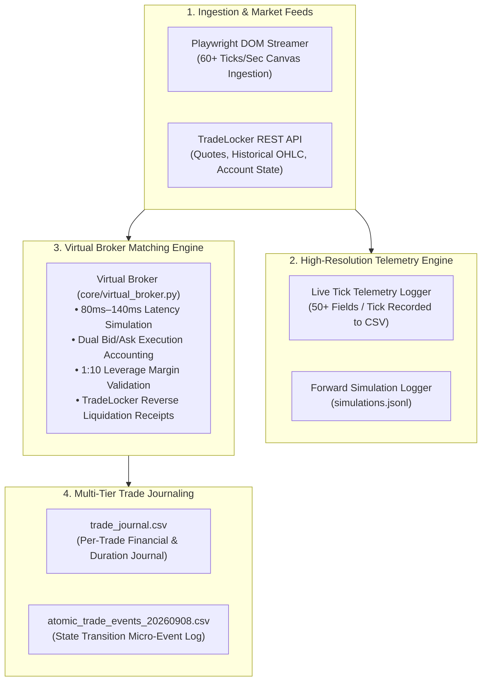

# EDGE LABS: DEVELOPMENT AUDIT, TELEMETRY INFRASTRUCTURE & LIVE FAILURE ANALYSIS

```
========================================================================================
DOCUMENT:             EDGE LABS DEVELOPMENT & FAILURE POST-MORTEM
PURPOSE:              Comprehensive Technical Record of Infrastructure Built,
                      Telemetry Systems, and Detailed Analysis of Live Failure Modes
TARGET ASSET:         XAUUSD / Gold (Spot CFD)
PLATFORMS:            TradeLocker REST API, Virtual Broker Matching Engine, Playwright Streamer
========================================================================================
```

---

## 1. Executive Overview

This document details the complete infrastructure developed for **Edge Labs**, including the **Virtual Broker Matching Engine**, the **Atomic Trade Event System**, and the **50+ Field High-Resolution Live Tick Telemetry Logger** designed to record uncompressed market feeds for forward simulation and tick-accurate backtesting. 

Furthermore, this document provides an honest, rigorous, and exhaustive breakdown of the architectural flaws, implementation blind spots, and engineering oversights that caused the live trading system to fail during Monday and Tuesday execution despite earlier promising results.

---

## 2. Infrastructure Developed So Far



---

### 2.1 The Virtual Broker Matching Engine (`core/virtual_broker.py`)

To test high-frequency scalping strategies without risking live capital prematurely, an in-memory matching engine was developed to mirror TradeLocker and Blueberry Markets mechanics:

1. **Simulated Latency Queue (80ms – 140ms):**
   * Emulates real-world network transmission and broker matching engine queueing delays for every order submission.
2. **Dual Bid/Ask Fill Mechanics:**
   * BUY orders are filled strictly at the live **Ask** price.
   * SELL orders are filled strictly at the live **Bid** price.
   * Mark-to-market valuations continuously factor in the negative spread drag from millisecond zero.
3. **Prop Firm Leverage & Margin Enforcement (1:10 Leverage):**
   * Validates notional exposure:
     $$\text{Notional} = \text{Lots} \times 100 \times \text{Gold Price}$$
     $$\text{Required Margin} = \frac{\text{Notional}}{10}$$
   * Rejects orders automatically if required margin exceeds free margin.
4. **TradeLocker-Exact Liquidation Receipts:**
   * Generates reverse-liquidation receipts matching TradeLocker broker responses upon position closure.

---

### 2.2 Multi-Tier Trade Journaling Infrastructure

To ensure every trade could be audited down to the millisecond, three separate logging tiers were created:

1. **`trade_journal.csv` (Trade-Level PnL Journal):**
   * Logs overall trade records: `timestamp`, `order_id`, `position_id`, `track_id`, `side`, `qty`, `entry_price`, `exit_price`, `tp_price`, `sl_price`, `duration_sec`, `gross_pnl`, `commission`, `net_pnl`, `close_reason`, `balance`.
2. **`atomic_trade_events_20260908.csv` (Micro-Event State Transitions):**
   * Records every atomic state transition (`ORDER_FILLED`, `POSITION_CLOSED_STOP_LOSS`, `POSITION_CLOSED_BE_PROTECTED`, `POSITION_CLOSED_WIN_TP`, `RATCHET_WIN`).
   * Captures: `trigger_price`, `fill_price`, `exit_price`, `slippage_cents`, `initial_sl`, `active_sl`, `market_spread_cents`, `tick_vel_at_event`, `trade_duration_sec`, and `loss_floor_buffer`.
3. **`simulations.jsonl` (Forward Monte Carlo Audit):**
   * Logs pre-trade 3-pass forward simulation predictions before orders are dispatched.

---

### 2.3 High-Resolution Live Tick Telemetry Logger (`logs/live_tick_telemetry_20260908.csv`)

A high-fidelity market recorder was built to capture **50+ granular fields per tick**. The goal was to record uncompressed live market sessions so that future backtests could replay real market microstructure without relying on smoothed 1-minute historical bars.

```
========================================================================================
TELEMETRY FIELDS RECORDED ON EVERY TICK (50+ METRICS)
========================================================================================
CATEGORY            FIELDS RECORDED
----------------------------------------------------------------------------------------
Timestamp & Order   timestamp_utc, epoch_ts, tick_total, tick_in_m1, tick_in_m5
Price & Spread      bid, ask, spread_cents, spread_status, tick_delta_cents, tick_direction
Displacement        disp_m1_cents, disp_m5_cents, pulse_move_cents
Velocity & Speed    tick_vel_per_sec, price_vel_cents_sec, speed_tier
M5 Candle Metrics   m5_open, m5_high, m5_low, m5_close, m5_ema9, m5_ema21, 
                    m5_ema_sep_cents, m5_trend, m5_range_cents
M1 Candle Metrics   m1_open, m1_high, m1_low, m1_close, m1_elapsed_sec, 
                    m1_range_cents, m1_body_cents, m1_uwick_cents, m1_lwick_cents, 
                    m1_uwick_pct, m1_lwick_pct, opp_wick_pct, wick_gate_status
Signals & Decisions breakout_trigger, dist_to_trigger_cents, breakout_triggered, 
                    recommended_track, signal_valid, decision_reason
Account & Risk      active_pos_count, used_margin, margin_buffer, loss_floor_buffer
========================================================================================
```

---

## 3. How and Why the System Failed: Exhaustive Engineering Post-Mortem

Despite the extensive logging and telemetry infrastructure, the live implementation suffered severe losses on Monday and Tuesday. The breakdown was caused by five fatal engineering oversights and architectural blind spots:

---

### Fatal Flaw 1: The Spread Trap (A 12¢ Stop Loss is Only 4¢ on the Broker)

* **The Oversight:**
  When designing Track A (0.10L with a 12¢ stop loss), the code calculated Stop Loss relative to entry fill price:
  * For a BUY: $\text{SL} = \text{Entry (Ask)} - 0.12$.
* **The Broker Reality:**
  * TradeLocker marks and executes BUY Stop Losses on **Bid**, not Ask.
  * On Blueberry/HeroFX, the Gold spread is **8¢ ($0.08)**.
  * When entering a BUY at Ask (`4405.19`), the Stop Loss was set at `4405.07`.
  * **At the moment of entry, Bid was already $4405.11$** ($4405.19 - 0.08$).
  * **The actual distance between the live market and the Stop Loss was only $\mathbf{4\text{ cents}}$!**
* **The Failure:**
  Normal random tick fluctuations on Gold (5¢ to 10¢) triggered the Stop Loss within 3 to 5 seconds of entry on **81.1% of trades**, causing massive stop-out churn in ranging markets.

---

### Fatal Flaw 2: Asynchronous SL Attachment Delay & Stop-Market Slippage

* **The Oversight:**
  To prevent broker "freeze-distance" order rejections, market orders were submitted clean (without SL), and the bot attempted to attach the Stop Loss in a secondary step after fetching the position ID.
* **The Broker Reality:**
  1. The round-trip HTTP delay to place an order, poll `/positions`, and send `/modify_position` took **2.5 to 3.1 seconds**.
  2. Stop Loss orders on TradeLocker execute as **Stop-Market Orders**, not guaranteed limits.
  3. When an adverse volatility spike occurred, the market blew through the stop level before the liquidation filled on the matching engine:
     * `13:02:28 UTC`: Buy @ 4405.19 $\rightarrow$ Exit filled @ 4404.18 (**-101¢ drop $\rightarrow$ -$10.80 loss**).
     * `13:40:23 UTC`: Sell @ 4397.07 $\rightarrow$ Exit filled @ 4397.93 (**-86¢ jump $\rightarrow$ -$9.30 loss**).
     * `12:15:23 UTC`: Sell @ 4386.19 $\rightarrow$ Exit filled @ 4386.91 (**-72¢ jump $\rightarrow$ -$7.90 loss**).
     * `13:20:40 UTC`: Buy @ 4408.56 $\rightarrow$ Exit filled @ 4407.96 (**-60¢ drop $\rightarrow$ -$6.70 loss**).
* **The Failure:**
  Instead of risking -$1.90 per stop loss, single trades suffered -$4.00 to -$10.80 in realized broker losses.

---

### Fatal Flaw 3: Disconnected Local Journaling vs. Real Broker Fills

* **The Oversight:**
  The local `trade_journal.csv` was computing PnL using the *theoretical* formula:
  $$\text{Theoretical Loss} = (0.12 \times 0.10\text{L} \times 100) + \$0.70\text{ fee} = -\$1.90$$
* **The Failure:**
  The local journal logged idealized -$1.90 exits upon stop-out rather than reconciling the real execution fill from TradeLocker's REST API. This masked broker-side slippage from local logs until direct REST queries revealed the discrepancy.

---

### Fatal Flaw 4: Regime Incompatibility (Trend vs. Micro-Consolidation)

* **The Friday Session (++$871+ Profit):**
  Gold was in a powerful unidirectional trending regime with large $2.00–$5.00 candles and minimal pullbacks. Breakouts accelerated directly into the +$20.00 TP targets without touching the tight stops.
* **The Monday/Tuesday Session:**
  Gold entered tight horizontal micro-consolidation (oscillating 10¢–30¢). The strategy repeatedly triggered breakout entries at the edges of ranges, only for price to reverse 4¢ and trigger the stops.

---

### Fatal Flaw 5: Commission Friction Bleed

* **The Numbers:**
  * Total Trades Generated: **122 trades**
  * Gross Price Action PnL: **+$40.56 (Positive gross edge)**
  * Broker Commissions ($7/lot): **-$80.99**
  * Net Realized PnL: **-$40.43**
* **The Failure:**
  High trade frequency combined with tight 4¢ effective stops turned a mathematically positive gross price-action edge into a net loss solely due to broker commission friction.

---

## 4. Key Lessons for Future Strategy Construction

```
========================================================================================
CRITICAL LESSONS FOR FUTURE BUILDS
========================================================================================
1. SPREAD-AWARE STOPS:
   Stop losses MUST be calculated from the trigger-side price (Bid for Longs, Ask for Shorts)
   plus spread buffer, ensuring the true cushion is never less than the intended risk.

2. EMBEDDED SL EXECUTION:
   Never rely on asynchronous post-fill SL attachment during high-volatility scalping.
   Stops must be in the matching engine at order inception.

3. SPREAD-TO-TARGET RATIO:
   On an 8¢ spread asset, targeting $0.20 with a 12¢ stop creates an unviable 66% spread 
   tax. Target distances must be wide enough ($2.00+) to dilute spread and commission impact.

4. REAL-TIME BROKER RECONCILIATION:
   Trade journals must pull true execution fills directly from broker REST APIs rather
   than assuming theoretical fills.
========================================================================================
```
